

  

  

    

      Browse Repos
    

     
    <h3>Minor</h3>
    

      <a href="https://github.com/paveloom-m/Makefiles">
        
      </a>
      <a href="https://github.com/paveloom-m/QtSettingsDemo">
        
      </a>
    

    <h3>Packs</h3>
    

      <a href="https://github.com/paveloom-p/P1">
        
      </a>
      <a href="https://github.com/paveloom-p/P2">
        
      </a>
    

    

      <a href="https://github.com/paveloom-p/P3">
        
      </a>
      <a href="https://github.com/paveloom-p/P5">
        
      </a>
    

    

      <a href="https://github.com/paveloom-p/P6">
        
      </a>
      <a href="https://github.com/paveloom-p/P7">
        
      </a>
    

    

      <a href="https://github.com/paveloom-p/P8">
        
      </a>
      <a href="https://github.com/paveloom-p/P9">
        
      </a>
    

    <h3>Docker</h3>
    

      <a href="https://github.com/paveloom-d/dev">
        
      </a>
      <a href="https://github.com/paveloom-d/binder-base">
        
      </a>
    

    

      <a href="https://github.com/paveloom-d/binder-tex">
        
      </a>
      <a href="https://github.com/paveloom-d/binder-julia">
        
      </a>
    

    

      <a href="https://github.com/paveloom-d/binder-julia-plots">
        
      </a>
    

    <h3>Julia</h3>
    

      <a href="https://github.com/paveloom-j/Scats.jl">
        
      </a>
      
    

    <h3>Complex</h3>
    

      <a href="https://github.com/paveloom-c/C1">
        
      </a>
      
    

    

      <a href="https://github.com/paveloom-c/GPKernels">
        
      </a>
    

  

    

